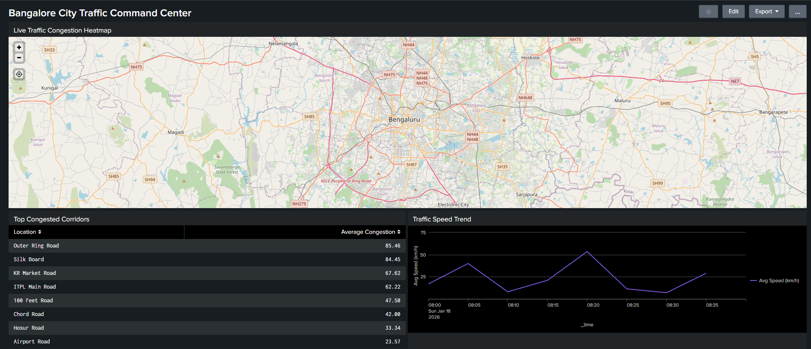

# City Traffic Monitoring Dashboard (Classic)

This project demonstrates how real-world city traffic data can be ingested, enriched, and visualized using Splunk Classic Dashboards.

The solution simulates a production-grade observability use case by integrating external traffic data, processing it through Cribl, and presenting actionable insights in Splunk.

---

## Dashboard Highlights
- City-wise congestion KPIs
- Current speed vs free-flow speed comparison
- Travel time delay analysis
- Congestion percentage trends
- Geo-based traffic visualization (latitude/longitude)
- Confidence-based data quality insights

---

## Technology Stack
- TomTom Traffic Flow API
- Python (API data fetch & normalization)
- Cribl Stream (data parsing, enrichment, routing)
- Splunk Enterprise / Splunk Cloud
- Classic Dashboards (Simple XML)
- SPL, JSON data modeling

---

## Data Pipeline Overview
- Traffic data is fetched from the TomTom API using a Python script
- Events are streamed into Cribl for parsing and enrichment
- Cribl calculates congestion metrics and routes data to Splunk HEC
- Splunk indexes structured traffic events and powers dashboards

---
## Screenshots

## Files Included
- `scripts/tomtom_traffic_fetcher.py` – Python script to fetch live traffic data
- `cribl/traffic_pipeline.json` – Cribl pipeline for parsing and enrichment
- `data/city_traffic_sample.json` – Sample traffic data (offline testing)
- `dashboard/city_traffic_classic_dashboard.xml` – Classic Splunk dashboard XML

---

## Notes
- Live TomTom API access requires a valid API key
- Splunk Cloud access is not provided due to licensing constraints
- Sample JSON data is included to allow dashboard preview and SPL validation
- The dashboard XML represents a production-ready Classic dashboard

---

## Author
Abhijeet Ranu  
Splunk Admin & Developer (8+ years)
